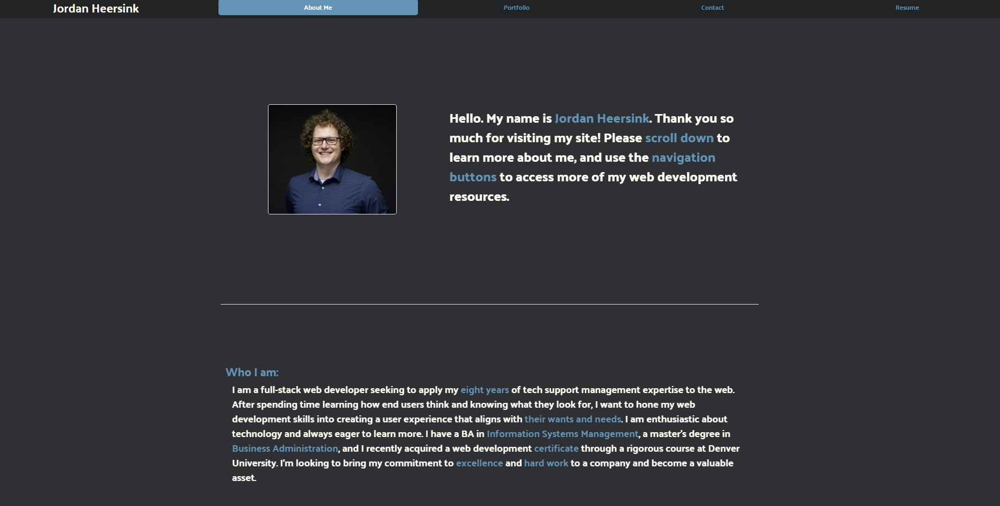

# Jordan Heersink Portfolio 

GitHub Repo: https://github.com/jheersink8/react-portfolio

Deployed Site: 

## Description

The content on this page is a portfolio page for Jordan Heersink. It includes highlights about me, some of my web development projects, and ways to contact me. This portfolio was built in React. 

## Usage

The purpose of this site is meant to (1) demonstrate what I can do and (2) provide information about me. The portfolio itself is a demonstration of my ability to use React and some of my favorite projects can be found under the portfolio page. To see content about who I am, please read the “About” section for a brief overview. Additionally, there are links to my LinkedIn profile, my resume, and information on how to contact me. 

## Credits

This page was built using React and Bootstrap 

The timeline was built using https://www.bootdey.com/snippets/view/timeline-events

All SVG files were acquired from the website https://www.svgrepo.com/svg/ 

## License
https://opensource.org/licenses/MIT 

  Copyright (c) {{ 2024 }} {{ Jordan Heersink }}
    Permission is hereby granted, free of charge, to any person obtaining a copy
    of this software and associated documentation files (the "Software"), to deal
    in the Software without restriction, including without limitation the rights
    to use, copy, modify, merge, publish, distribute, sublicense, and/or sell
    copies of the Software, and to permit persons to whom the Software is
    furnished to do so, subject to the following conditions:
    
    The above copyright notice and this permission notice shall be included in all
    copies or substantial portions of the Software.
    
    THE SOFTWARE IS PROVIDED "AS IS", WITHOUT WARRANTY OF ANY KIND,
    EXPRESS OR IMPLIED, INCLUDING BUT NOT LIMITED TO THE WARRANTIES OF
    MERCHANTABILITY, FITNESS FOR A PARTICULAR PURPOSE AND NONINFRINGEMENT.
    IN NO EVENT SHALL THE AUTHORS OR COPYRIGHT HOLDERS BE LIABLE FOR ANY CLAIM,
    DAMAGES OR OTHER LIABILITY, WHETHER IN AN ACTION OF CONTRACT, TORT OR
    OTHERWISE, ARISING FROM, OUT OF OR IN CONNECTION WITH THE SOFTWARE OR THE USE
    OR OTHER DEALINGS IN THE SOFTWARE.